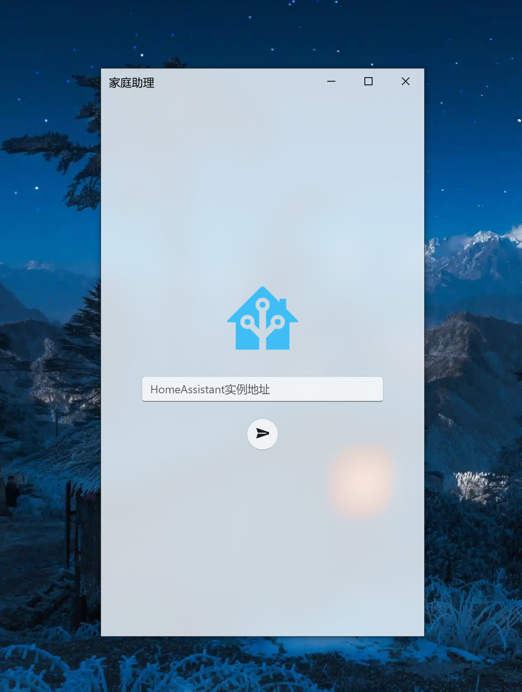
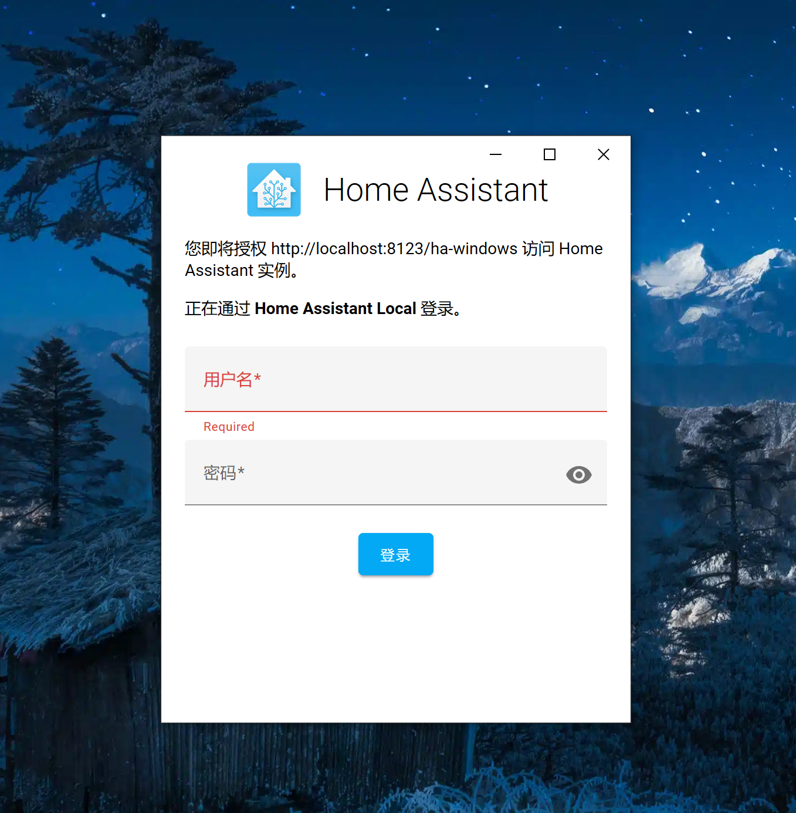
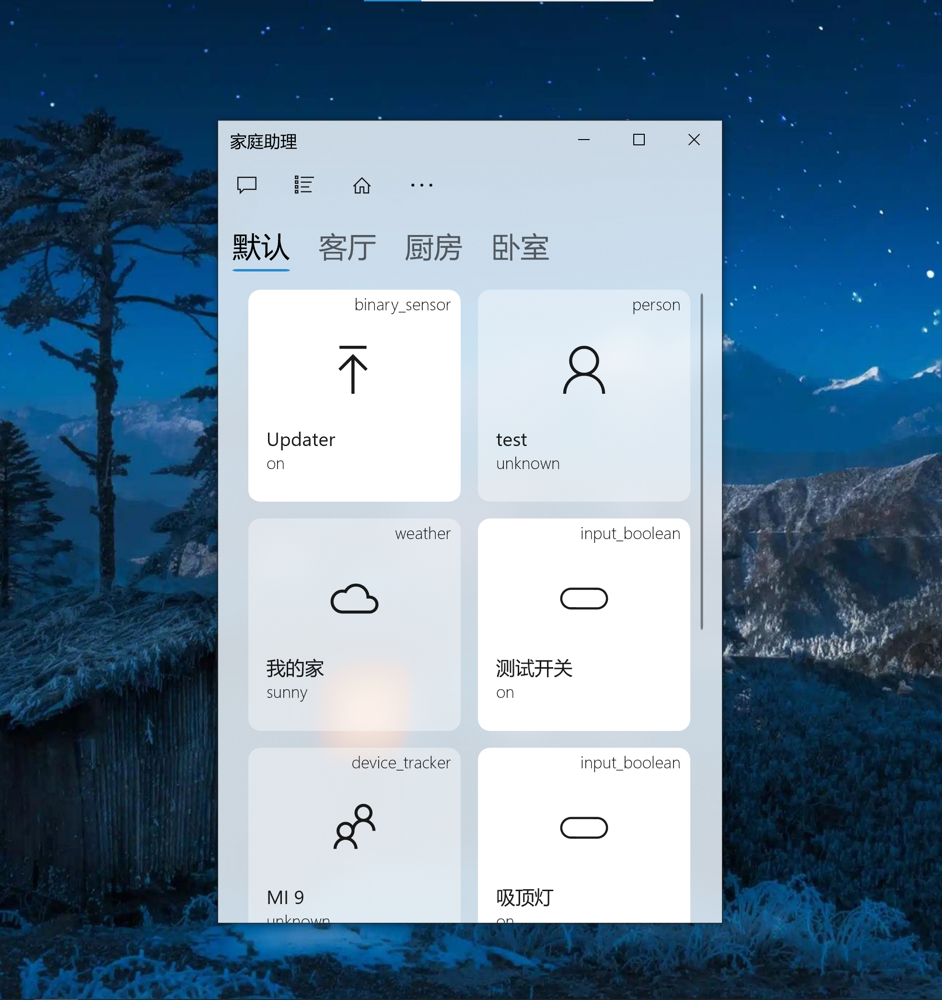
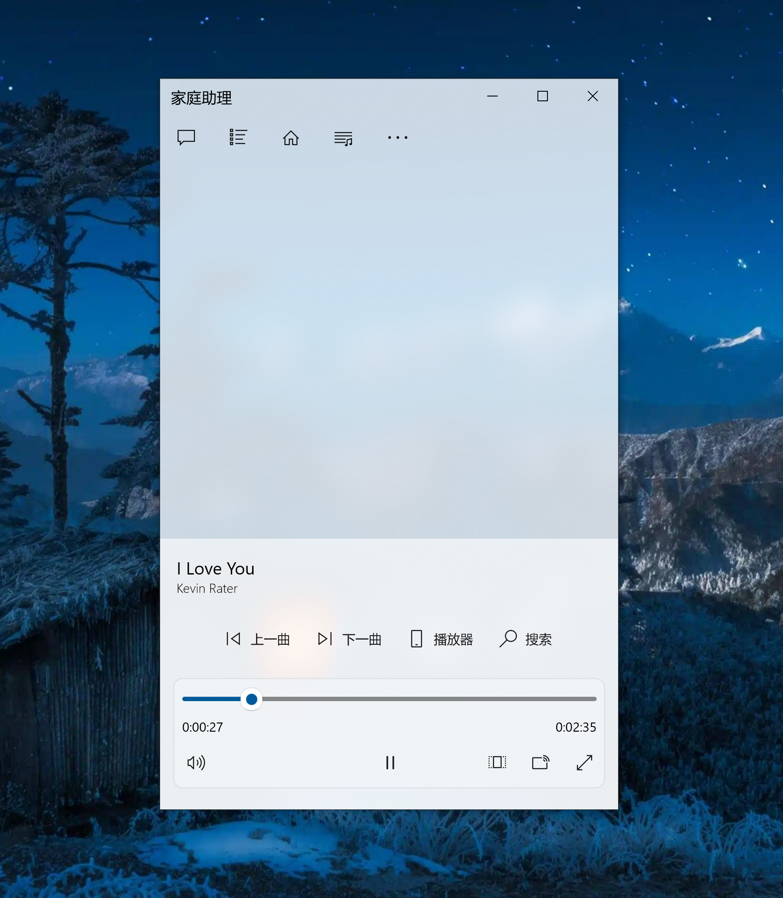
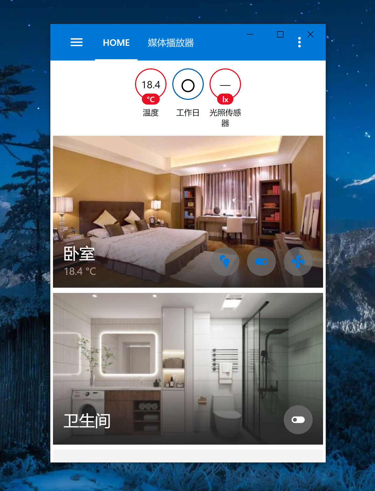
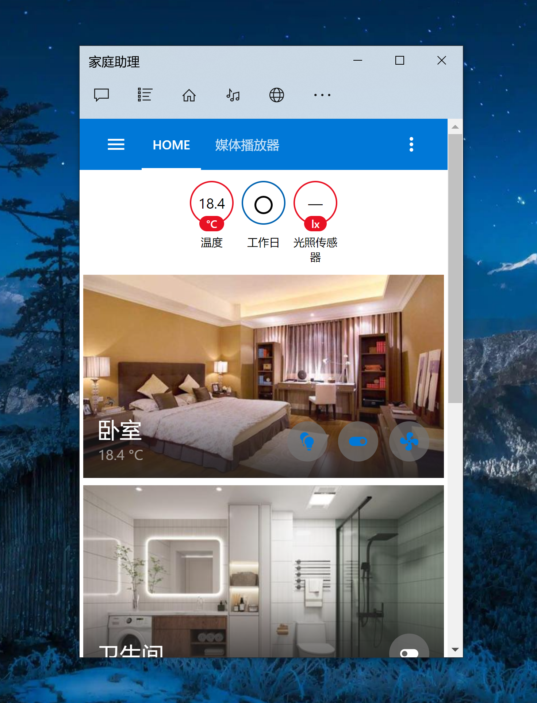

# Home Assistant Windows App

在Home Assistant中安装使用自定义Conversation组件，通过语音文字命令控制智能设备

[](https://www.home-assistant.io/)


[](https://www.microsoft.com/zh-cn/store/productId/9n2jp5z9rxx2)

## 使用方式

### 依赖插件
在 Home Assistant 中安装启用 `conversation`

> 语音小助手

https://gitee.com/shaonianzhentan/conversation

> 云音乐

https://gitee.com/shaonianzhentan/ha_cloud_music

### 快捷键

- 语音控制 Voice：`Ctrl+V`
- 显示设备界面 Device：`Ctrl+D`
- 显示区域界面 Area：`Ctrl+A`
- 显示音乐界面 Music：`Ctrl+M`
- 显示网页界面 Web：`Ctrl+W`
- 全屏显示：`F11`

## 应用截图











## 更新日志

### To do list
- [ ] 增加录音发送到云音乐播放功能

- [ ] 支持多实例切换功能
- [ ] 加入设置页面
- [ ] 支持禁用/启用音效
- [x] 磁贴动态显示通知数量
- [ ] 语音唤醒
- [x] 支持switch、input_boolean的开关
- [x] 支持light的开关
- [x] 支持fan的开关
- [x] 支持climate的开关
- [x] 支持automation的开关、触发
- [x] 支持script的执行

### dev
- [ ]新增设置界面
- [ ]新增自定义网页显示功能
- [ ]支持音效开关
- [ ]增加快捷键
- [ ]支持媒体播放器卡片控制

### 1.0.15
- 登录界面自动显示局域网HomeAssistant实例
- 修复连接VPN后无法登录的问题
- 新增点击实体分类，快速选择的功能
- 新增右键单击实体显示属性信息的功能
- 新增部分实体点击的控制
- 修复断线时无法重新连接的问题
- 修复执行命令为空的问题

### 1.0.14
- 修复未安装对应组件时应用闪退的问题
- 增加云音乐播放列表查看功能

### 1.0.13
- 最小化时保持连接
- 支持磁贴文字控制
- 支持命令控制
- 修复注册设备实体问题
- 增加设备连接状态传感器
- 新增云音乐插件联动播放
- 新增固定任务栏功能
- 关于应用中新增服务地址

### 1.0.7
- 调整主界面
- 支持设备注册，电量传感器
- 支持WebSocket在线通知
- 登录界面支持返回与刷新
- 新增区域显示
- 新增初始界面默认localhost实例
- 新增语音助手消息设备面板
- 设备面板支持media_player的控制
- 优化实体图标
- 优化设备图标

### 1.0.6
- 新增最近使用设备页面
- 优化语音识别逻辑
- 支持部分设备的开关
- 调整初始窗口大小

### 1.0.3

- 支持标题透明
- 支持自动搜索HomeAssistant实例
- 加入音效
- 未授权麦克风权限时跳转申请
- 未开启语音在线识别时跳转申请
- 修复长时间不操作，授权失效的问题
- 完善关于应用信息
- 增加语音识别时，正在聆听的提示
- 修复关闭Windows语音在线识别时，程序异常退出的问题
- 支持快捷键`Ctrl + H`触发语音识别功能
- 检查是否安装配置语音小助手组件

### 1.0.1

- 支持授权登录HomeAssistant
- 支持语音文本控制设备
- 支持浏览器打开HomeAssistant
- 支持退出重新授权登录


## 赞助开发

如果你对这个Windows应用有兴趣，可以联系我获取本应用的免费兑换码

赞助费50元，制作不易，还请理解。 

联系方式Q`635147515`

## 事件参数

更新磁贴
```yaml
type: tile
tile:
  type: update
  from: from
  subject: subject
  body: body
```

清除磁贴
```yaml
type: tile
tile:
  type: clear
```

文本转语音
```yaml
type: tts
data: 这里使用系统的TTS功能
```

## 执行命令
此功能依赖win32程序，否则无法使用
```yaml
type: cmd
data: 执行命令
```
- 使用浏览器打开网址`'start "" "https://home-assistant.io"'`
- 打开桌面上的微信`'start "" "%USERPROFILE%\desktop\微信.lnk"'`
- 60秒后关机`'shutdown -s -f -t 60'`
- 60秒后重启电脑`'shutdown -r -f -t 60'`
- 取消关机命令`'shutdown -a'`
- 显示桌面`'explorer.exe shell:::{3080F90D-D7AD-11D9-BD98-0000947B0257}'`
- 更多...

打开视频
```yaml
type: video
data: 监控视频链接
```

特定命令
```yaml
type: exe
data: 特定命令
```
- 发送全局快捷键`'keyboard shift+win+s'`
- 设置鼠标位置`'mouse_pos 100,100'`
- 移动鼠标位置`'mouse_move 100,100'`

## 开机启动

1. 生成桌面快捷方式
2. 打开开机启动目录：`shell:startup`
3. 创建文件：`家庭助理.cmd`
4. 写入以下内容
```bat
::更换终端显示字符
CHCP 65001
::为了防止有还没连网的情况发生，所以这里延迟执行
TIMEOUT /T 10
::不知道为啥，第一次启动会崩溃，再次启动就正常
start "" "%USERPROFILE%\desktop\家庭助理.lnk"

::重新启动程序
TIMEOUT /T 10
start "" "%USERPROFILE%\desktop\家庭助理.lnk"
```